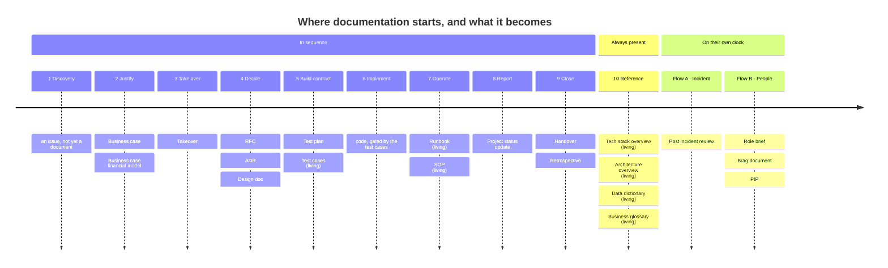

# Documentation

Start here. Every document in this tree has one home, and the folder it sits in tells you what
kind of document it is — whether it is maintained, and whether you can trust it as current.

## Start with these

Fill these in as the project acquires them. Until a row exists, that question has no answer here.

| If you want to… | Read |
|---|---|
| Understand how the system works today | `architectures/{slug}.md` — usually `system.md` |
| Know what is *not* built, or not decided | the same file → Known Limitations |
| Use the app day to day | `sops/{slug}.md` |
| Run or operate the app | `sops/{slug}.md` |
| Look up a field or table | [data-dictionary.md](data-dictionary.md) |
| Look up a term | [business-glossary.md](business-glossary.md) |
| Know what technology is used and why | [tech-stack-overview.md](tech-stack-overview.md) |
| Understand why a choice was made | [adrs/](adrs/) |

## The two kinds of document

This distinction matters more than any other, because it tells you whether what you are reading is
still true.

**Living** — no date in the filename, revised in place, carries a Revision History. Current by
definition; if it is wrong, fix it.

**Point-in-time** — `{yyyyMMddHHmm}-{slug}.md`, never revised. A record of what was decided or
intended at a moment. Superseded by a newer document rather than edited. **Do not read these as
descriptions of the running system.**

## The lifecycle

Where documentation starts and where it continues. Each project picks the subset that fits — this
is the default path, not a checklist.

**(living)** marks a document that is maintained forever. Everything unmarked is a point-in-time
record that closes and is never revised.

**Seven of the twenty are living**, and they are not confined to one phase. Test cases sit in the
build-contract phase beside the test plan, yet the plan is a dated snapshot of one release's
strategy while the cases are maintained as features change. Runbooks and SOPs are living in the
middle of the operate phase. Only the last four belong to no phase at all.

**The always-living section is not a later phase**, even though it reads last. Shipping updates the
architecture overview and the data dictionary immediately; neither waits for the project to close,
and both keep changing long after phase 9 is done. The final section sits outside the sequence for
the same reason — incidents happen whenever they happen, and a project can close while post-incident
reviews continue against the same system for years.

Four details that do not survive being shortened into a diagram node:

- **Takeover and Handover are one template**, used incoming at phase 3 and outgoing at phase 9.
- **ADRs are emergent.** One can crystallise during the RFC, during design, or after the fact
  during implementation. Write it when the decision becomes real.
- **Test plan is optional** and runs parallel to the design doc; per-feature work is usually
  covered by test cases and CI gates alone.
- **The always-living four each have their own trigger**, not a schedule: the tech stack overview
  changes when an ADR changes a technology, the architecture overview when behaviour or structure
  shifts, the data dictionary on any schema change with no ADR required, and the business glossary
  when terminology enters or moves.

## What goes where

| Folder | Kind | Contains |
|---|---|---|
| `architectures/` | Living | How an existing system, module or area works. Diátaxis *Explanation*. Multiple allowed — pick the narrowest scope with a real audience. |
| `adrs/` | Point-in-time | One architectural decision each. **Immutable once accepted** — to change a decision, write a new ADR and mark the old one superseded. |
| `rfcs/` | Point-in-time | Proposals under discussion. Closes with a decision, which becomes one or more ADRs. |
| `designs/` | Point-in-time | How a feature was going to be built, written before it was. Not maintained. |
| `runbooks/` | Living | On-call procedures. Symptom → Diagnosis → Mitigation → Rollback. |
| `sops/` | Living | Repeatable procedures with no incident attached. If nobody is on call, it is an SOP, not a runbook. |
| `data-dictionary.md` | Living singleton | Schema, fields, types, relationships. Updated on any schema change — no ADR required. |
| `business-glossary.md` | Living singleton | Domain terms. Updated when terminology enters or shifts. |
| `tech-stack-overview.md` | Living singleton | What technology is used and why. Carries no version numbers — the package manifest owns those. |
| `docfx/` | — | Documentation site configuration. |

Further folders exist in the convention and are created when first needed rather than up front:
`specs/`, `diagrams/`, `notebooks/`, `pirs/`, `test-plans/`, `test-cases/`, `tickets/`, `projects/`.

## The distinction people get wrong

**`designs/` vs `architectures/`.** A *design doc* says how something will be built, is dated, and
is finished the moment it ships — you never update it. An *architecture overview* says how the
thing works now, has no date, and you maintain it forever. The same system usually has one of each:
a design doc from when it was built, and an overview that outlives it.

When they disagree, the architecture overview is correct.

## Adding a document

Placement rules and templates come from the **documentation-generator** skill. **Read the matching
`templates/{type}.md` in full before writing** — the section lists in that skill's `SKILL.md` are an
index, not a substitute, and composing from them drops the sections nobody thinks to invent:
Cross-Cutting Concerns, Rollback, Verify Completion, Revision History.

Two rules that prevent the most common damage:

- **Never invent content to fill a template section in an accepted ADR or any historical record.**
  Restructure and rename freely; author new prose never. A missing section is honest — a fabricated
  Assumptions or Risks section corrupts the record.
- **Where a section genuinely does not apply, say so in a line** rather than deleting the heading.
  An explicit absence is information; a missing heading is indistinguishable from an oversight.
