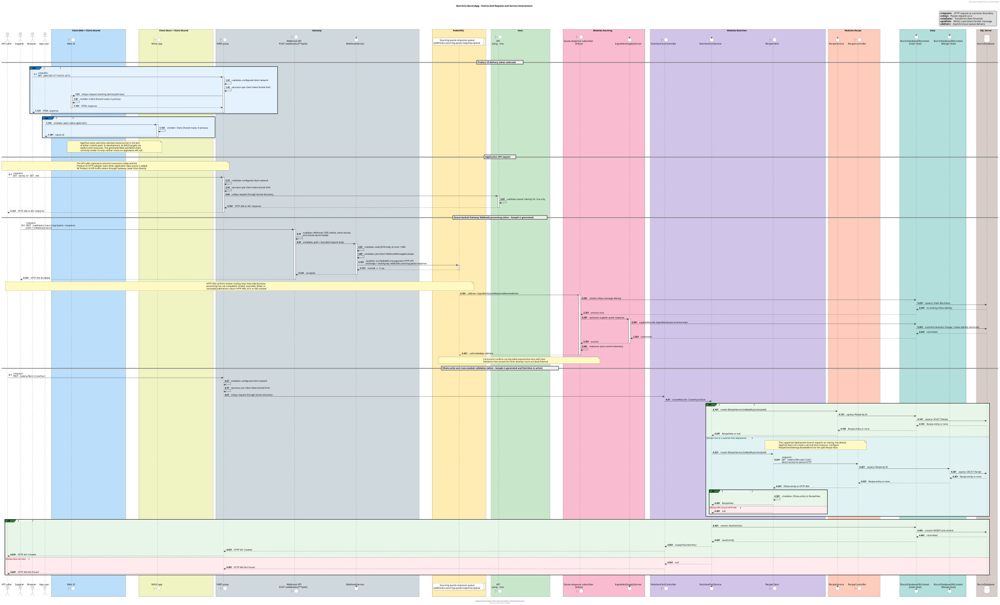

# Architecture Overview: BurcinCo.BurcinApp System

## Metadata

- **Last Updated:** (document-date-compact)
- **Owner:** (authors)
- **Physical Scope:** Repository/Product
- **Covered Area:** Entire generated application

## Purpose

BurcinCo.BurcinApp is a .NET distributed application with a public Gateway, a separately deployable
application Host, and an Aspire AppHost that assembles the system for local development and publishing.
This living document explains the system as it exists today for engineers who need to understand its
boundaries and runtime behavior without first reading the implementation.

## Context

External HTTP traffic enters through the Gateway, which relays application requests to the Host.
<!--#if (Web) -->
Requests under `/portal` instead go to the independent Web runner.
<!--#endif -->
<!--#if (Sample) -->
Supplier callbacks use the Gateway-owned Webhook adapter, which publishes accepted envelopes to a RabbitMQ
exchange; RabbitMQ routes them to the Sourcing subscriber-declared queue for asynchronous Host-side processing.
<!--#endif -->
AppHost starts and wires resources but never handles an application request itself.

```mermaid
flowchart LR
    Caller[API caller] --> Gateway[Gateway]
    Gateway --> Host[Host]
<!--#if (Sample) -->
    Supplier[External supplier] -->|POST webhook| Gateway
    Gateway -->|persistent envelope| RabbitMQ[(RabbitMQ)]
    RabbitMQ -->|queued delivery| Host
<!--#endif -->
<!--#if (Web) -->
    Browser[Browser] --> Gateway
    Gateway --> Web[Client.Web]
    Web --> Shared[Client.Shared]
<!--#endif -->
<!--#if (Maui) -->
    Maui[Client.Maui] --> Shared[Client.Shared]
<!--#endif -->
    AppHost[AppHost] -. starts and wires .-> Gateway
    AppHost -. starts and wires .-> Host
<!--#if (Web) -->
    AppHost -. starts and wires .-> Web
<!--#endif -->
<!--#if (Maui) -->
    AppHost -. explicit-start local targets .-> Maui
<!--#endif -->
    AppHost -. provisions .-> Infrastructure[(SQL Server and Redis)]
    AppHost -. provisions .-> RabbitMQ
```

<!--#if (ClientShared) -->
`Client.Shared` is an in-process Razor Class Library rather than a network service.
<!--#if (Web) -->
The Web runner renders it inside the Web process.
<!--#endif -->
<!--#if (Maui) -->
The MAUI runner renders it inside the native process.
<!--#endif -->
Server runners do not reference client projects; AppHost may reference deployable projects only to describe
orchestration.
<!--#endif -->

## Architecture

The system separates orchestration, edge routing, application composition, product UI, and business
capabilities. Service discovery connects deployable processes without compile-time references between the
Gateway and its destinations. The Host remains a thin composition runner. The view below makes source
ownership and dependency direction explicit: every rectangle is one generated project, solid arrows are
compile-time project references, and dashed arrows are orchestration, provisioning, runtime, or design-time
tooling interactions. Where AppHost both references and orchestrates Gateway or Host, this view shows the
compile-time reference; the Context view above shows the orchestration relationship. The common repository
prefix is omitted from project labels to keep the view readable.
<!--#if (Sample) -->
The reference application modules own the selected business behavior even though their adapters and services
execute inside a Host process.
<!--#endif -->

```mermaid
flowchart TB
    subgraph Runners["Orchestration and deployable projects"]
        direction LR
        AppHost["AppHost<br/>orchestration"]
        Gateway["Gateway<br/>edge process"]
        Host["Host<br/>composition process"]
    end
<!--#if (ClientShared) -->
    subgraph Clients["Product UI projects"]
        Shared["Client.Shared<br/>Razor Class Library"]
<!--#if (Web) -->
        Web["Client.Web<br/>Web process"]
<!--#endif -->
<!--#if (Maui) -->
        Maui["Client.Maui<br/>native process"]
<!--#endif -->
    end
<!--#endif -->
<!--#if (Sample) -->
    subgraph Capabilities["Business capability and contract projects"]
        RecipeContracts["Modules.Recipe.Abstractions<br/>public contracts"]
        Recipe["Modules.Recipe<br/>Catalog capability"]
        Nutrition["Modules.Nutrition<br/>Tracking capability"]
        SourcingContracts["Modules.Sourcing.Abstractions<br/>public contracts"]
        Sourcing["Modules.Sourcing<br/>Procurement capability"]
    end
<!--#endif -->
<!--#if (EntityFrameworkScaffold) -->
    subgraph Persistence["Persistence projects"]
        Models["Models<br/>entities and persistence policies"]
        Data["Data<br/>runtime DbContext and mappings"]
        Migrations["Migrations<br/>design-time schema tooling"]
    end
<!--#endif -->
    subgraph Infrastructure["Runtime infrastructure resources"]
        Sql[(SQL Server)]
        Redis[(Redis)]
<!--#if (Sample) -->
        RabbitMQ[(RabbitMQ<br/>Webhook exchange + Modules.Sourcing-owned queue)]
<!--#else -->
        RabbitMQ[(RabbitMQ)]
<!--#endif -->
    end

    AppHost --> Gateway
    AppHost --> Host
<!--#if (Web) -->
    Web --> Shared
    AppHost -.->|orchestrates by project path| Web
    Gateway -.->|HTTP /portal| Web
<!--#endif -->
<!--#if (Maui) -->
    Maui --> Shared
    AppHost -.->|orchestrates explicit-start targets| Maui
<!--#endif -->
    Gateway -.->|application HTTP through service discovery| Host
<!--#if (EntityFrameworkScaffold) -->
    Host --> Data
    Data --> Models
    Migrations --> Data
    Data -.->|EF persistence| Sql
    Migrations -.->|design-time schema operations| Sql
<!--#endif -->
<!--#if (Sample) -->
    Host --> Recipe
    Host --> Nutrition
    Host --> Sourcing
    Recipe --> RecipeContracts
    Recipe --> Data
    Recipe --> Models
    Nutrition --> RecipeContracts
    Nutrition --> Data
    Nutrition --> Models
    Sourcing --> SourcingContracts
    Sourcing --> Data
    Sourcing --> Models
    Gateway -.->|Webhook adapter: management HTTP publish| RabbitMQ
    RabbitMQ -.->|queued delivery to Sourcing subscriber| Host
    Host -.->|broker connection| RabbitMQ
<!--#endif -->
    AppHost -. provisions .-> Sql
    AppHost -. provisions .-> Redis
    AppHost -. provisions .-> RabbitMQ
<!--#if (CacheRedis) -->
    Host -.->|cache connection| Redis
<!--#endif -->
<!--#if (CacheSqlServer) -->
    Host -.->|cache connection| Sql
<!--#endif -->
```

### Components

| Component | Responsibility | Key technologies |
|-----------|----------------|------------------|
| `BurcinCo.BurcinApp.AppHost` | Declares resources, dependencies, service discovery, startup order, and publish behavior; it is not a request hop. | .NET Aspire |
| `BurcinCo.BurcinApp.Gateway` | Owns the public edge, YARP routes, client-address trust, CIDR safelists, token-bucket rate limits, health, and metrics. | ASP.NET Core, YARP, OpenTelemetry |
| `BurcinCo.BurcinApp.Host` | Thin runner that composes authentication, middleware, process endpoints, and selected dependencies and capabilities. It owns no application contracts, business logic, data tooling, or service implementations. | ASP.NET Core, JWT bearer authentication, OpenTelemetry |
<!--#if (ClientShared) -->
| `BurcinCo.BurcinApp.Client.Shared` | Owns reusable routes, layout, pages, presentation services, and shared UI assets; it is not a process. | Razor Class Library, Fluent UI |
<!--#endif -->
<!--#if (Web) -->
| `BurcinCo.BurcinApp.Client.Web` | Hosts the shared UI as an independent interactive server application under `/portal` and owns its own container image boundary through its Dockerfile. | Blazor Interactive Server |
<!--#endif -->
<!--#if (Maui) -->
| `BurcinCo.BurcinApp.Client.Maui` | Hosts the shared UI in native Android, iOS, Mac Catalyst, and Windows shells. Its app-local `wwwroot/index.html` bootstraps `BlazorWebView`, which maps the shared routes in-process. | .NET MAUI Blazor Hybrid |
<!--#endif -->
<!--#if (EntityFrameworkScaffold) -->
| `BurcinCo.BurcinApp.Models` | Owns generated database-first entities, overwrite-safe partial extensions, persistence-policy marker interfaces under `Abstractions/`, and database-tied constants and enums under `BurcinDatabaseConstants/`. | Entity Framework Core models |
| `BurcinCo.BurcinApp.Data` | Owns the shared runtime `BurcinDatabaseDbContext`, mappings, conventions, and provider registration. | Entity Framework Core, SQL Server |
| `BurcinCo.BurcinApp.Migrations` | Owns design-time context creation and explicit schema migration tooling; no runner applies migrations at startup. | Entity Framework Core migrations |
<!--#endif -->
<!--#if (Sample) -->
| `BurcinCo.BurcinApp.Modules.Recipe.Abstractions` | Owns the Recipe service interface and request/response contracts consumed across module boundaries. | .NET contracts |
| `BurcinCo.BurcinApp.Modules.Recipe` | Reference Catalog capability containing Recipe, Chef, Category, Tag, and RecipePhoto services. | ASP.NET Core, OData, Entity Framework Core |
| `BurcinCo.BurcinApp.Modules.Nutrition` | Reference Tracking capability containing the NutritionFact service and a Recipe dependency that resolves in-process or through HTTP. | ASP.NET Core, OData, Entity Framework Core |
| `BurcinCo.BurcinApp.Modules.Sourcing.Abstractions` | Owns public Sourcing requests, responses, service contracts, and supplier-response broker contracts. | .NET contracts, source-generated JSON metadata |
| `BurcinCo.BurcinApp.Modules.Sourcing` | Reference Procurement capability containing IngredientSupply, supplier integration, and reliable broker flows. | ASP.NET Core, Entity Framework Core, RabbitMQ, Ruya reliable messaging |
| Gateway Webhook adapter (inside `BurcinCo.BurcinApp.Gateway`) | Authenticates and bounds supplier callbacks, translates JSON into a persistent envelope, and publishes it to RabbitMQ without making a domain decision. | ASP.NET Core minimal API, RabbitMQ management HTTP API |
| RabbitMQ Webhook handoff | Routes the Gateway-published envelope to the subscriber-declared Sourcing queue for asynchronous Host processing. | RabbitMQ exchange and queue |
<!--#endif -->

## Runtime Behavior

### Application API request

The catch-all Gateway route evaluates the configured proxy safelist and per-client token-bucket limiter, then
relays the request to the Host through Aspire service discovery. Host authentication and endpoint policies are
applied after the proxy hop. AppHost is deliberately absent from the runtime request path.

<details>
<summary>End-to-end request and service interactions</summary>

Each colored section is one project, module, or infrastructure owner. Project labels omit the common repository
prefix, while participant types and labels describe runtime roles.

> [!TIP]
> [Edit the PlantUML source](attachments/system/request-flow.puml) and render it with the repository PlantUML tooling.
> Select the diagram to open the full-size vector image.

[](attachments/system/request-flow.svg)
</details>

The diagram keeps the currently implemented Product UI paths separate from the application-client path. The
optional `Client.Web` and `Client.Maui` shells do not yet issue application API requests. When product behavior
needs server data, its HTTP adapter uses the same Gateway boundary shown for the application client; it does not
address a Host or module deployment directly. OData is an HTTP adapter inside Host, while the application
services behind it choose an in-process implementation or a direct service-to-service HTTP client according to
deployment activation.

<!--#if (Web) -->
### Web portal request

`/portal/{**catch-all}` is a higher-priority Gateway route to the `client-web` service-discovery destination.
The Gateway intentionally retains the `/portal` prefix: `Client.Web` consumes it with `UsePathBase("/portal")`
and declares `<base href="/portal/">`. A portal request therefore follows Browser → Gateway → Client.Web;
it does not pass through Host. `Client.Shared` renders in-process inside the Web runner. AppHost starts the Web
resource only after the Gateway is running.
<!--#endif -->

<!--#if (Maui) -->
### Native client startup

AppHost models Windows, Mac Catalyst, Android-emulator, and iOS-simulator targets as explicit-start resources
that wait for the Gateway and are excluded from deployment manifests. The app-local `wwwroot/index.html`
bootstraps `BlazorWebView`, which maps `Client.Shared.Routes` into the native process. The current shell renders
that shared UI locally and does not yet make an application API request.
<!--#endif -->

<!--#if (Sample) -->
### Reference OData and service-to-service request

When the Sample is generated and `Modules.Nutrition` is active, `POST /odata/NutritionFact` demonstrates the
complete synchronous application path. Gateway relays the request to Host's Nutrition OData controller, which
delegates the write to `NutritionFactService`. The service validates the referenced recipe through
`IRecipeService`: `RecipeService` handles the call in-process when Recipe is active in the same Host, while
`RecipeClient` sends `GET /odata/Recipe({id})` directly to a separately deployed Recipe Host when it is not.
That internal request does not loop back through the public Gateway. Both deployments use their own scoped
`BurcinDatabaseDbContext` against the shared database described in the accepted architecture.

### Reference messaging flows

The Sourcing reference module writes business state and an Outbox message atomically before RabbitMQ delivery.
The Outbox record selects Sourcing's configured non-default queue dispatcher rather than relying on a process
default. Subscribers use bounded exponential delayed retry with jitter; work that exceeds the finite delivery
count is dead-lettered instead of retrying forever.
The Sample Gateway implements inbound Webhook ingestion as a queue-backed RabbitMQ handoff. A supplier posts to
`/webhooks/{**path}`; the Gateway authenticates and bounds the request, translates its path and JSON body into a
persistent `WebhookMessageEnvelope`, and publishes it through RabbitMQ's management HTTP API. For
`/webhooks/sourcing/quote-response`, both the exchange and routing key are
`webhooks.sourcing.quote-response`; RabbitMQ routes the envelope to the Sourcing subscriber's queue. The queue is
hosted by RabbitMQ but declared and logically owned by the Sourcing subscription; it is not an in-process Gateway
queue.

Gateway returns `202 Accepted` only after RabbitMQ reports `routed=true`; that response confirms the broker
handoff, not completion of Sourcing business processing. The Host-side subscriber then performs
Inbox-deduplicated processing, commits the quote change and Inbox identity atomically, emits post-commit telemetry,
and acknowledges the delivery. Concurrent conflicts use bounded exponential retry with jitter, and deliveries
that exhaust the finite attempt count are dead-lettered. The Gateway adapter translates edge traffic but makes no
domain decision.
<!--#endif -->

## Data Model

<!--#if (EntityFrameworkScaffold) -->
The application uses one database-first SQL Server model and one shared `BurcinDatabaseDbContext`. Generated
entities live in `BurcinCo.BurcinApp.Models`, runtime persistence lives in `.Data`, and design-time migrations
live in `.Migrations`. Schema changes are applied through the explicit Entity Framework tooling rather than by
a running application process.
<!--#if (Sample) -->
The reference model separates Recipe, Nutrition, and Sourcing tables by schema. Reliable-messaging Outbox and
Inbox records live in `dbo`; Inbox identity prevents duplicate broker deliveries from repeating business work.

| Schema | Owner | Tables |
|--------|-------|--------|
| `Recipe` | Modules.Recipe | Chef, Recipe, RecipeExpansion, CategoryCode, CategoryGroup, CategoryCodeGroupMapping |
| `Nutrition` | Modules.Nutrition | NutritionFact |
| `Sourcing` | Modules.Sourcing | IngredientQuote |
| `dbo` | Cross-cutting infrastructure | Outbox, Inbox, `__EFMigrationsHistory` |

Module-owned tables live in their own schema. Per-deployment SQL users receive broad `SELECT` and narrow
`INSERT`, `UPDATE`, and `DELETE` permissions only on their module schema, enforcing isolation at the database
tier.
<!--#else -->
The shared EF Core scaffold contains the Models, Data, and Migrations boundaries but no reference business
schema. Define the application's schemas, entities, and owning modules before creating its initial migration;
the migration must describe deliberate ownership rather than accidentally establishing it.
<!--#endif -->
<!--#else -->
No shared Entity Framework persistence model is generated. AppHost still declares baseline local SQL Server,
Redis, and RabbitMQ resources; selected application capabilities decide which resources they consume.
<!--#endif -->

## Cross-Cutting Concerns

### Security

The Gateway resolves the trusted client address before applying its edge policies. The `gateway-proxy`
token bucket permits a 200-request burst and replenishes 50 tokens every five seconds.
<!--#if (Sample) -->
The `gateway-webhook` policy permits a 30-request burst and replenishes ten tokens every ten seconds.
<!--#endif -->
Rejected requests receive `429 Too Many Requests`, a Problem Details body, and `Retry-After` when the limiter
can calculate it. Limits are maintained in-process and therefore apply per Gateway replica; globally coordinated
quotas belong at the ingress, WAF, or API-management layer. Health and Prometheus endpoints are not rate limited.

CIDR safelists are available for proxy and operations surfaces but default to disabled.
<!--#if (Sample) -->
The Webhook surface has its own safelist.
<!--#endif -->
An enabled policy rejects unknown or disallowed addresses with `403 Forbidden`; empty lists, invalid CIDRs,
and universal `/0` networks fail startup validation. Individual addresses normalize to `/32` or `/128`.
`/metrics` is protected by the operations safelist.

Direct traffic uses the socket peer address. Forwarded headers remain disabled unless the deployment supplies
a finite forward limit and explicit trusted proxies or networks. The Gateway rejects the trust-all
`ASPNETCORE_FORWARDEDHEADERS_ENABLED` switch so authorization and rate limiting never rely on an untrusted
`X-Forwarded-For` value.

Host configures JWT bearer authentication. `/me` requires authorization, while `/ping` is anonymous; endpoint
owners must explicitly apply authorization to additional application APIs. Non-development runners enable
HSTS and HTTPS redirection.

<!--#if (Sample) -->
The Webhook edge adapter uses the tighter rate limit above, caps request bodies at 1 MiB, and requires its
shared-secret header outside Development.
<!--#endif -->

### Observability

Host and Gateway emit OpenTelemetry logs, metrics, and traces and expose Prometheus scraping plus live, ready,
and startup health endpoints. Gateway instrumentation includes YARP and ASP.NET Core rate limiting. AppHost
provides the Aspire dashboard and OTLP wiring for local and published environments.

### Scalability & Performance

Host and Gateway are independently deployable processes. Gateway clusters use round-robin load balancing with
active destination health checks. The default rate limiter is in-process, so its quota is local to each
Gateway replica rather than globally coordinated.
<!--#if (Web) -->
The Web runner is independently deployable from both server runners.
<!--#endif -->

<!--#if (Sample) -->
The reference modular-polylith design supports one Host image running different module selections in separate
deployments. Feature selections are captured once during startup so registration and endpoint mapping cannot
diverge during a process lifetime.
<!--#endif -->

### Reliability

AppHost expresses dependency ordering for local startup. Gateway actively checks Host health before routing.
<!--#if (Web) -->
The Web destination also has an active health check.
<!--#endif -->
Host and Gateway expose separate liveness, readiness, and startup probes.
<!--#if (Sample) -->
The reference messaging path's persistence and delivery guarantees are documented under
[Reference messaging flows](#reference-messaging-flows). Webhook broker publication uses a timeout and circuit
breaker but deliberately does not retry a non-idempotent management API request.
<!--#endif -->

## Design Decisions

- Modular application and deployment boundaries — see [ADR: Modular Polylith architecture](../adrs/(document-stamp)-modular-polylith-architecture.md).

## Operational Characteristics

- **Deployment:** Aspire models local execution and Docker Compose publishing for Host, Gateway, and baseline infrastructure.
<!--#if (Web) -->
- **Web deployment:** Aspire publishes the Web runner as a separate Docker Compose service.
<!--#endif -->
<!--#if (Maui) -->
- **Native distribution:** MAUI targets are packaged separately and excluded from the publish manifest.
<!--#endif -->
- **Environments:** Development, Integration, Testing, Staging, and Production configuration files are present; environment URLs and credentials are deployment-owned.
- **Owner team:** (authors)
- **On-call:** Not defined by the generated application.

## Known Limitations

<!--#if (!Sample) -->
- The generated output is an infrastructure and composition skeleton until product-specific domain capabilities are added.
<!--#endif -->
- CIDR safelists and forwarded-header trust require deployment configuration, and Gateway rate limits are per replica rather than global.
- AppHost provisions SQL Server, Redis, RabbitMQ, and Durable Functions Monitor even when selected application capabilities do not consume every resource.
- Checked-in Kubernetes and delivery automation currently cover the Host integration path, not the complete AppHost multi-process topology.
- Startup readiness in Host and Gateway is a short completion marker rather than a real initialization workflow.
<!--#if (Maui) -->
- MAUI orchestration uses a preview Aspire integration, is local-development only, and has no implemented API integration.
<!--#endif -->
<!--#if (Web) -->
- The Web runner renders shared UI but has no implemented Host API integration or authentication flow.
<!--#endif -->
<!--#if (EntityFrameworkScaffold) -->
- No initial Entity Framework migration is checked in; migrations are created and applied explicitly.
<!--#endif -->

## References

- Repository overview: root `README.md`
- [SOP: Configure Gateway edge protections](../sops/configure-gateway-edge-protections.md)
- [ADR: Modular Polylith architecture](../adrs/(document-stamp)-modular-polylith-architecture.md)

## Revision History

| Date | Author | Changes |
|------|--------|---------|
| (document-date-compact) | (authors) | Initial version |
